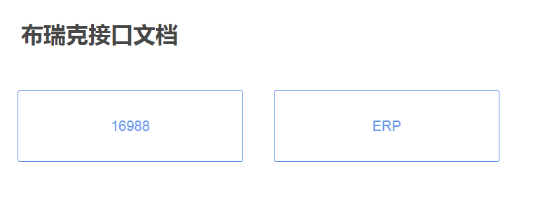
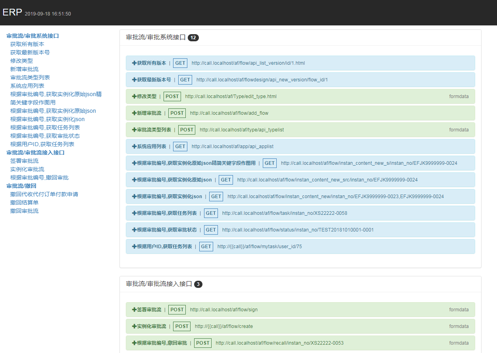

# postman_docgen

集成postman自动生成接口文档

## Demo

# 用法

## 1.下载项目，

下载地址：[https://github.com/pingmalu/postman_docgen/archive/v0.2.zip](https://github.com/pingmalu/postman_docgen/archive/v0.2.zip)

## 2.把下载下来的文件解压

    postman_docgen-0.2.zip

## 3.修改其中config.php配置文件，并保存

    <?php
    $config['title'] = 'xxx接口文档';
    $config['lists'] = [
        '16988'=>'286796-a89c27b8-8a0d-4801-xxx',
        'ERP'=>'286796-56970c1b-5c2d-40b7-xxx',    
    ];
    $config['tk'] = 'PMAK-5d81948c29aa8f00361219e2-xxx';

根据自己项目，把对应的参数填入

$config['title'] 项目标题

$config['lists'] 是postman的collections ID

$config['tk'] 是postman的apikey

### collections ID 如何获取?

打开网址：https://app.getpostman.com/

找到对应的collections，把浏览器地址栏中collections后面的ID复制下来

### postman的apikey 如何获取？

打开网址：https://app.getpostman.com/

找到个人中心，生成apikey，把对应的apikey复制下来

## 2.把项目放在php环境

访问对应的地址，例： [http://192.168.1.45/api_m/](http://192.168.1.45/api_m/)

## 3.在服务器上给docgen文件可执行权限

    cd api_m/
    chmod 777 docgen

## 4.触发更新hooks

访问网站目录下的update.php，例： [http://192.168.1.45/api_m/update.php](http://192.168.1.45/api_m/update.php)